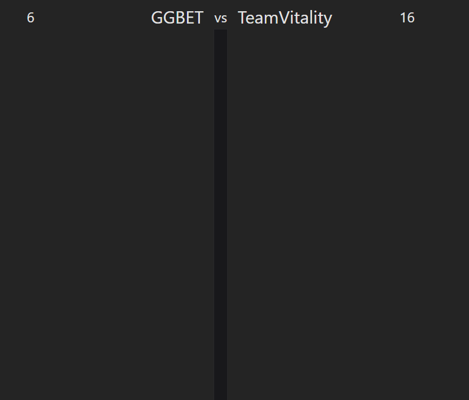

# CS:GO Match Timeline

This is a *timeline*-visualizer for CS:GO match [logs](backend/NAVIvsVitaGF-Nuke.txt).

## 1. Introduction

The idea is to make a scrollable, vertical timeline for the whole match, with events distributed so you can easily see when they occured compared to each-other.

## 2. Structure

I parse the file in two passes.
1. Read and identify a type for each log-entry
2. Create the resources I need to serve to the frontend. E.g. `matches`, `kills` and `rounds`.

## 3. Cut corners

I cut some corners to focus on the more interesting things.

### No database
- I use a memory cache to save the result of reading the file and of parsing it.
### Assuming player- and team-tags are unique
- So I can use them as ids.
### Message types 
- Parsing functionality not robust for other log-files. E.g. admin messages seem to be able to be prefixed with weird random chars (wonder what these are...?).
- The categorization into types would likely benefit from a better understanding of CS:GO. 

## 4. TODO

I hacked this together using techs I've never tried (vite, tailwind, node.js). I didn't have enough time to polish everything up. Maybe I did a poor job scoping the task? Or maybe it's OK that I focused on getting as much functionality out as possible at the cost of leaving parts of the code a bit messy?

### Properly set-up eslint and prettier
Fix formatting inconsistencies like string `"`/`'` and end-of-line `;`.

### Utilize horizontal axis
Position kill-icons on the killer's team's side of the timeline. Even better, add player-avatars on each side with a line connecting a killer to the victim.

### More data
Add icons to timeline for 
- win-condition,
- bomb-plant,
- defuse,
- team playing CT/Terrorist,
- hostage-events.
Add more kill-data in tooltip; e.g. headshot and assisting players.

### Bundle kill-icons by proximity
E.g., in the current implementation, with kills on 0, 4 and 5 seconds, the first two kills would be bundled, but it would be nicer if the last two were bundled instead.